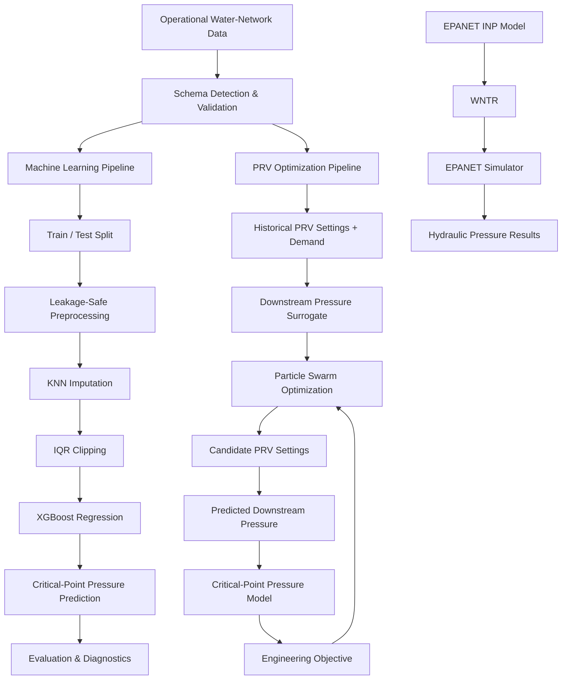
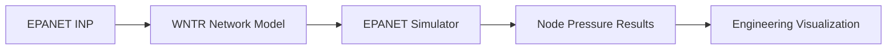
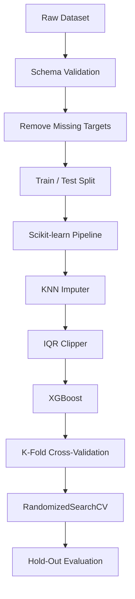
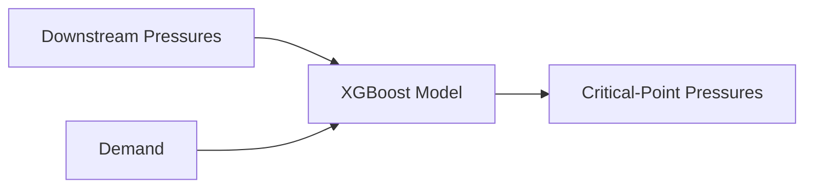
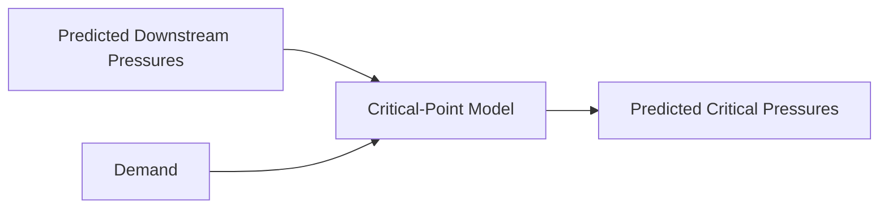
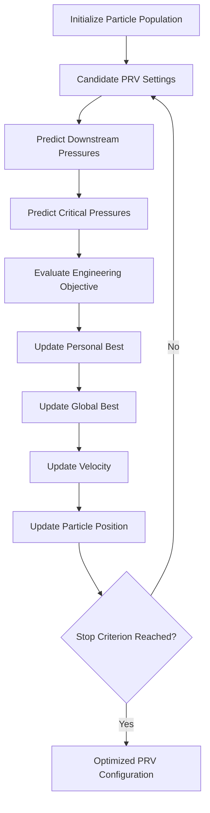
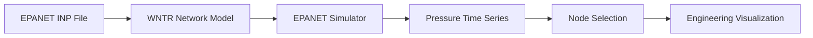

<div align="center">

# 💧 Water Network AI Analyzer

### Intelligent Pressure Prediction & PRV Optimization for Water Distribution Networks

**Industrial AI · Machine Learning · XGBoost · Particle Swarm Optimization · WNTR / EPANET**

A desktop engineering platform that combines **leakage-safe machine learning, surrogate-based PRV optimization, and hydraulic simulation** for intelligent water-distribution analysis.

[Overview](#overview) ·
[Architecture](#high-level-architecture) ·
[Machine Learning](#machine-learning-pipeline) ·
[Optimization](#prv-optimization) ·
[Hydraulics](#hydraulic-simulation) ·
[Quick Start](#quick-start) ·
[Limitations](#limitations)

</div>

---

## Overview

**Water Network AI Analyzer** is an applied Industrial AI platform designed to support data-driven analysis and decision-making in water-distribution systems.

The application integrates three complementary engineering workflows:

1. **Machine Learning** for predicting critical-point pressures.
2. **Particle Swarm Optimization** for exploring improved Pressure Reducing Valve (PRV) settings.
3. **WNTR / EPANET simulation** for independent physics-based hydraulic analysis.

The project is intentionally designed around a clear separation between **learned surrogate models** and **hydraulic simulation**.

The machine-learning and optimization pipelines learn relationships from historical operational data, while the WNTR / EPANET path evaluates a physical network model when an EPANET `.inp` file is available.

---

## Key Capabilities

### Machine Learning

- XGBoost regression
- Single-output and multi-output prediction
- Leakage-safe preprocessing
- Distance-weighted KNN imputation
- Fold-local IQR outlier clipping
- Randomized hyperparameter search
- K-Fold cross-validation
- Hold-out evaluation
- Feature-importance analysis
- Model persistence with Joblib

### PRV Optimization

- Particle Swarm Optimization
- Automatic PRV-variable detection
- Dataset-derived operating bounds
- Sequential multi-period optimization
- Pressure-constraint penalties
- Preferred-pressure objective
- Stability-aware optimization
- Historical-reference penalties
- PSO convergence tracking

### Hydraulic Analysis

- WNTR network modeling
- EPANET `.inp` loading
- EPANET simulation through WNTR
- Node-pressure extraction
- Critical-node selection
- Hydraulic-result visualization

### Desktop Application

- Tkinter graphical interface
- CSV data loading
- Automatic schema detection
- Editable data tables
- Model training and evaluation
- Manual prediction
- Actual-vs-predicted visualization
- Feature-importance visualization
- PRV optimization
- Convergence visualization
- Model save / load
- Result export
- Application logging

---

# High-Level Architecture



The platform contains two intentionally distinct analytical paths:

- **Data-driven AI and optimization**
- **Physics-based hydraulic simulation**

The current PSO workflow evaluates learned surrogate models rather than executing EPANET inside every optimization iteration.

---

## End-to-End Workflow


Optional hydraulic analysis follows a separate workflow:



---

# Machine Learning Pipeline

## Leakage-Safe Preprocessing

Preventing information leakage is a central design principle.



Preprocessing operations are fitted inside the machine-learning pipeline rather than on the full dataset before splitting.

This prevents hold-out data from influencing:

- Missing-value imputation
- Outlier thresholds
- Hyperparameter selection
- Model training

---

## Missing-Value Handling

Missing input features are handled using distance-weighted KNN imputation:

```python
KNNImputer(
    n_neighbors=5,
    weights="distance"
)
```

Target variables are not imputed.

Rows with missing target values are excluded because artificially generating regression targets would compromise evaluation validity.

---

## IQR Outlier Handling

The project implements a custom scikit-learn-compatible `IQRClipper`.

For each feature:

```text
IQR = Q3 - Q1

Lower Bound = Q1 - 1.5 × IQR
Upper Bound = Q3 + 1.5 × IQR
```

Values outside these limits are clipped rather than removed.

Because `IQRClipper` is part of the training pipeline, its thresholds are independently fitted within each cross-validation fold.

---

## Predictive Modeling

The primary prediction model is **XGBoost Regressor**.

For single-target regression:

```text
Network Features
      │
      ▼
   XGBoost
      │
      ▼
Target Pressure
```

For multiple pressure targets, the implementation uses:

```python
MultiOutputRegressor(
    XGBRegressor(...)
)
```

This allows several critical-point pressures to be predicted simultaneously.

---

## Critical-Point Pressure Model

The critical-point model learns the relationship between downstream network conditions and critical locations.



The trained model can also be reused within the optimization workflow to evaluate candidate valve configurations.

---

## Hyperparameter Optimization

Model tuning is performed using:

```text
RandomizedSearchCV
```

The search space includes parameters such as:

- Number of estimators
- Maximum tree depth
- Learning rate
- Subsample ratio
- Column sampling
- Minimum child weight
- L1 regularization
- L2 regularization

Cross-validation uses shuffled K-Fold splitting with a fixed random seed.

The current default configuration uses:

```text
5 cross-validation folds
14 randomized search iterations
```

when sufficient training data is available.

---

## Model Evaluation

Regression performance is evaluated using complementary metrics.

| Metric | Purpose |
|---|---|
| **MAE** | Mean absolute prediction error |
| **RMSE** | Penalizes larger prediction errors more strongly |
| **R²** | Measures explained variance / goodness of fit |
| **MAPE** | Measures relative percentage error |

For multi-output regression, metrics can also be analyzed independently for each target.

Additional diagnostics include:

- Actual vs. predicted plots
- Feature-importance analysis
- Per-target metrics
- Selected hyperparameters
- Cross-validation performance
- Training duration
- Hold-out evaluation

---

# PRV Optimization

The optimization engine uses **Particle Swarm Optimization (PSO)** to search for improved Pressure Reducing Valve configurations.

> The PSO workflow is a **data-driven surrogate optimizer**, not a hydraulic solver.

The optimization environment is built around two learned relationships.

---

## Downstream Pressure Surrogate


This model learns how historical PRV settings and system demand relate to downstream pressure.

---

## Critical-Point Surrogate



Together, the two learned models create the environment evaluated by PSO.

---

## PSO Workflow



---

## Optimization Objective

The PSO objective combines several engineering considerations.

### Pressure Constraints

Candidate solutions are penalized when predicted pressure falls outside the configured operating range.

Default range:

```text
10 ≤ Pressure ≤ 60
```

### Preferred Pressure

The current default target pressure is:

```text
30
```

### Stability

Large PRV-setting changes between consecutive optimization periods are penalized.

This discourages unnecessarily aggressive control changes.

### Historical Reference

Candidate solutions can also be penalized when they deviate excessively from historically observed PRV settings.

This helps keep optimization closer to realistic operating regions.

---

## Default PSO Configuration

The current configuration uses:

| Parameter | Default |
|---|---:|
| Particles | `36` |
| Iterations | `70` |
| Maximum inertia | `0.90` |
| Minimum inertia | `0.40` |
| Cognitive coefficient | `1.70` |
| Social coefficient | `1.90` |
| Velocity fraction | `0.20` |
| Sequential periods | `24` |

These values are configurable and should not be interpreted as universally optimal settings.

---

## Automatic PRV Detection

PRV variables are identified from the dataset rather than from a fixed valve count.

The optimization dimensionality therefore reflects the PRV-related columns actually present in the loaded data.

---

## Data-Driven Operating Bounds

Optimization bounds are derived from observed historical PRV values and constrained by configured safety limits.

This creates a search region that better reflects historical system operation than assigning identical arbitrary limits to every valve.

---

## Sequential Optimization

The system supports sequential optimization across multiple operating periods.

The default configuration uses:

```text
24 periods
```

Previous optimized settings can influence subsequent periods through the stability component of the objective.

---

# Hydraulic Simulation

The application includes physics-based hydraulic analysis using **WNTR / EPANET**.

An EPANET network file can be loaded using:

```python
wntr.network.WaterNetworkModel(...)
```

and simulated through:

```python
wntr.sim.EpanetSimulator(...)
```

The resulting node-pressure time series can then be filtered, inspected, and visualized.



### Architectural Boundary

The WNTR / EPANET simulation path and the surrogate-based optimization path currently remain separate.

PSO does not execute a full hydraulic simulation inside every particle evaluation.

This distinction is intentional and prevents surrogate predictions from being represented as direct physics-based hydraulic optimization results.

---

## Dataset Schema Detection

The application performs semantic detection of common water-network column naming conventions.

### PRV Settings

Typical examples include:

```text
PRV1
PRV_01
PRV_Setting_1
```

### Downstream Pressure

Recognized naming patterns can include:

```text
*-B
*_B
after_valve
after valve
downstream
```

Examples:

```text
PRV-01-B
Valve1_B
Downstream_1
```

### Critical Points

Typical conventions include:

```text
J-*
critical*
critical_point*
```

Examples:

```text
J-101
J-205
Critical_Point_1
```

### Demand

Supported naming conventions can include:

```text
Demand
Deby
Flow
Total_Demand
P-676
```

The legacy `P-676` convention is retained for compatibility with the original project dataset.

---

## Desktop Application

The Tkinter-based interface provides dedicated workflows for each major system component.

### Data Management

- Load CSV datasets
- Inspect detected schema
- Browse network records
- Edit data
- Save modified datasets

### Machine Learning

- Train critical-point models
- Review evaluation metrics
- Inspect target-level performance
- Analyze feature importance
- Visualize actual vs. predicted values
- Generate manual predictions
- Save trained models
- Load previously trained models

### Optimization

- Train downstream-pressure surrogate models
- Run Particle Swarm Optimization
- Select optimization periods
- Inspect optimized PRV configurations
- Analyze predicted pressure behavior
- Review PSO convergence
- Export optimization results

### Hydraulic Analysis

- Load EPANET `.inp` files
- Execute WNTR / EPANET simulation
- Select network nodes
- Analyze pressure time series
- Visualize hydraulic results

---

# Quick Start

## 1. Clone the Repository

```bash
git clone https://github.com/mahmmooudian/water-network-ai-analyzer.git
cd water-network-ai-analyzer
```

---

## 2. Create a Virtual Environment

### Windows PowerShell

```powershell
python -m venv .venv
.venv\Scripts\Activate.ps1
```

### Windows Command Prompt

```cmd
python -m venv .venv
.venv\Scripts\activate.bat
```

### Linux / macOS

```bash
python3 -m venv .venv
source .venv/bin/activate
```

---

## 3. Install Dependencies

```bash
python -m pip install --upgrade pip
pip install -r requirements.txt
```

The dependency file includes the primary scientific, machine-learning, optimization-support, visualization, persistence, and WNTR packages required by the project.

---

## 4. Run the Application

```bash
python main.py
```

The desktop application will open and provide access to the available data, prediction, optimization, and hydraulic-analysis workflows.

---

## Model Persistence

Trained machine-learning pipelines can be serialized with Joblib.

A persisted model stores information such as:

- Trained pipeline
- Feature names
- Target names
- Evaluation metrics

This allows trained models to be restored without repeating the complete training workflow.

---

## Reproducibility

A fixed random seed is used across major stochastic components.

Default:

```text
42
```

This random state is used by components including:

- Train / test splitting
- Cross-validation
- Hyperparameter search
- XGBoost
- PSO initialization

Reproducibility reduces unnecessary experimental variation, although exact results may still depend on library versions, hardware, and execution environment.

---

# Technology Stack

| Area | Technologies |
|---|---|
| **Language** | Python |
| **Machine Learning** | XGBoost, Scikit-learn |
| **Data Processing** | Pandas, NumPy |
| **Optimization** | Particle Swarm Optimization |
| **Hydraulic Simulation** | WNTR, EPANET |
| **Visualization** | Matplotlib |
| **Desktop Interface** | Tkinter |
| **Model Persistence** | Joblib |
| **Configuration** | Python dataclasses |

---

## Project Structure

```text
water-network-ai-analyzer/
│
├── data/
├── docs/
├── gui/
├── hydraulics/
├── models/
├── optimization/
├── results/
├── visualization/
│
├── config.py
├── main.py
├── requirements.txt
├── README.md
├── LICENSE
└── .gitignore
```

The repository separates major responsibilities across dedicated project areas for:

- User interface
- Machine learning
- Optimization
- Hydraulic analysis
- Visualization
- Data
- Results
- Documentation

`main.py` serves as the primary application entry point.

`config.py` centralizes application, machine-learning, hydraulic, and optimization settings.

---

## Engineering Principles

### Leakage-Safe ML

Preprocessing is learned only within the appropriate training context.

### Reproducible Experiments

Major stochastic operations use a centralized random state.

### Clear Model Boundaries

Surrogate prediction and physics-based simulation remain explicitly distinguished.

### Engineering-Aware Optimization

The optimization objective considers pressure constraints, preferred operation, control stability, and historical settings.

### Transparent Evaluation

Multiple metrics and diagnostic visualizations are exposed rather than relying on a single performance score.

### Realistic Search Spaces

PRV optimization ranges are informed by historical operation and configuration limits.

### Reusable Models

Trained pipelines can be persisted and reused for later prediction workflows.

### Explicit Limitations

The project distinguishes research decision support from validated autonomous infrastructure control.

---

# Limitations

Water Network AI Analyzer is an **applied AI and engineering research platform**, not an autonomous production control system.

Current limitations include:

- Predictive performance depends on the quality, coverage, and representativeness of historical operational data.
- Learned surrogate models require engineering validation before operational use.
- Model calibration is dataset-specific.
- The PSO workflow optimizes learned surrogate models rather than hydraulic equations directly.
- WNTR / EPANET simulation is currently outside the PSO inner loop.
- Real-time SCADA / IoT ingestion is not implemented.
- Comprehensive automated unit and integration test coverage is not yet provided.
- Optimized PRV configurations should be reviewed by qualified domain experts before any real infrastructure application.

These limitations are documented explicitly to distinguish **research and decision-support capabilities** from **validated operational control**.

---

## Roadmap

Potential future development includes:

- Direct WNTR-in-the-loop optimization
- Automated unit and integration testing
- Continuous integration
- Time-series demand forecasting
- Leak and anomaly detection
- SCADA / IoT integration
- Model monitoring
- Experiment tracking
- Web-based engineering dashboard
- Containerized deployment
- Benchmark datasets
- Expanded hydraulic validation
- Comparative optimization studies

---

## Project Status

**Active Development**

The current platform provides:

- Leakage-safe XGBoost modeling
- Single-output and multi-output regression
- Critical-pressure prediction
- Hyperparameter optimization
- Feature-importance analysis
- Surrogate-based PRV optimization
- Engineering visualization
- Model persistence
- Desktop interaction
- WNTR / EPANET simulation

---

## Author

**Amir Mohammad Mahmoudian**

AI Engineer focused on **applied AI, machine learning, optimization, intelligent infrastructure, and ML systems**.

[GitHub](https://github.com/mahmmooudian) ·
[LinkedIn](https://www.linkedin.com/in/amirmohmmadmahmoudian)

---

## License

This project is released under the **MIT License**.

See [`LICENSE`](LICENSE) for details.

---

<div align="center">

### Machine Learning × Optimization × Hydraulic Engineering

**Building intelligent decision-support systems for real-world infrastructure.**

If this repository is useful to your work or research, consider giving it a ⭐.

</div>
