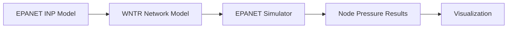
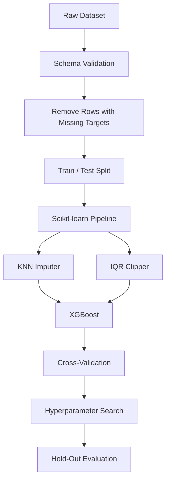
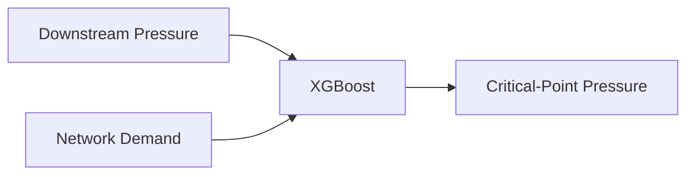
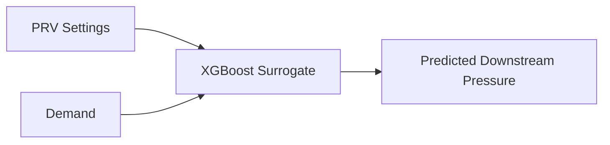
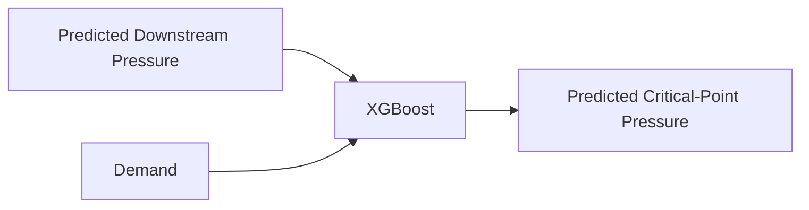
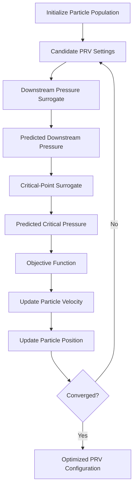
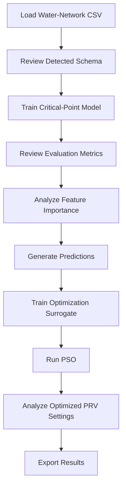
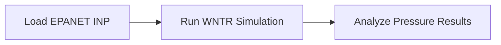

<div align="center">

# Water Network AI Analyzer

### Leakage-Safe Machine Learning & PRV Optimization for Water Distribution Networks

**Industrial AI · XGBoost · Particle Swarm Optimization · WNTR / EPANET · Engineering Analytics**

An applied AI platform for **water-distribution analysis, critical-pressure prediction, and PRV optimization**, combining data-driven machine learning with optional physics-based hydraulic simulation.

[Overview](#overview) • [Architecture](#high-level-architecture) • [ML Pipeline](#leakage-safe-machine-learning) • [Optimization](#prv-optimization) • [Quick Start](#quick-start) • [Technology](#technology-stack)

</div>

---

## Overview

**Water Network AI Analyzer** is a desktop-based Industrial AI application designed to support analysis and operational decision-making in water-distribution systems.

The platform combines:

- Machine-learning-based pressure prediction
- Leakage-safe preprocessing
- Multi-output XGBoost regression
- PRV optimization with Particle Swarm Optimization
- Data-driven surrogate modeling
- WNTR / EPANET hydraulic simulation
- Engineering-oriented visualization
- Interactive desktop analytics

The project intentionally separates two different analytical approaches:

**Data-Driven AI**  
Historical network measurements are used to train predictive surrogate models and optimize PRV settings.

**Physics-Based Simulation**  
When an EPANET network model is available, WNTR provides an independent hydraulic-simulation workflow.

This distinction prevents surrogate-model predictions from being presented as direct hydraulic simulation results.

---

## Key Capabilities

### Machine Learning

- XGBoost regression
- Single-output and multi-output prediction
- Leakage-safe preprocessing
- KNN missing-value imputation
- Fold-local IQR outlier clipping
- Randomized hyperparameter search
- Cross-validation
- Hold-out evaluation
- Feature-importance analysis
- Model persistence with Joblib

### PRV Optimization

- Particle Swarm Optimization
- Automatic PRV detection
- Dataset-derived operating bounds
- Sequential multi-period optimization
- Pressure-constraint penalties
- Target-pressure optimization
- Stability-aware control penalties
- Historical-reference penalties
- PSO convergence analysis

### Hydraulic Analysis

- WNTR integration
- EPANET `.inp` model loading
- EPANET simulation through WNTR
- Node-pressure analysis
- Hydraulic-pressure visualization

### Desktop Analytics

- Tkinter-based interface
- CSV data loading
- Automatic schema detection
- Editable data tables
- Model-training interface
- Critical-pressure prediction
- Actual-vs-predicted visualization
- Feature-importance visualization
- Optimization-result visualization
- Model save / load
- CSV export
- Application logging

---

# High-Level Architecture

```mermaid
flowchart TD
    A[Water Network Data] --> B[Schema Detection & Validation]

    B --> C[Machine Learning Pipeline]
    B --> D[PRV Optimization Pipeline]

    C --> E[Train / Test Split]
    E --> F[Leakage-Safe Preprocessing]
    F --> G[KNN Imputation]
    F --> H[IQR Outlier Clipping]

    G --> I[XGBoost Regression]
    H --> I

    I --> J[Critical-Point Pressure Prediction]
    J --> K[Evaluation & Diagnostics]

    D --> L[Historical PRV Settings + Demand]
    L --> M[Downstream Pressure Surrogate]
    M --> N[Particle Swarm Optimization]

    N --> O[Optimized PRV Settings]
    O --> P[Predicted Downstream Pressure]
    P --> Q[Critical-Point Surrogate]
    Q --> R[Engineering Analysis]

    S[EPANET .INP Model] --> T[WNTR]
    T --> U[EPANET Simulator]
    U --> V[Hydraulic Pressure Results]
```



The architecture contains two complementary but intentionally separate paths:

1. **Data-driven machine learning and optimization**
2. **Physics-based hydraulic simulation**

The current PSO workflow operates on learned surrogate models rather than repeatedly invoking EPANET during every optimization iteration.

---

## Engineering Workflow


For physics-based analysis:



---

# Leakage-Safe Machine Learning

Preventing information leakage is a core design principle of the project.

The machine-learning workflow follows:



Preprocessing components are fitted only on the relevant training data.

This prevents information from the hold-out test set from influencing imputation, outlier limits, or model training.

---

## Data Preprocessing

### KNN Imputation

Missing feature values are handled using:

```python
KNNImputer(
    n_neighbors=5,
    weights="distance"
)
```

The imputer is part of the machine-learning pipeline.

Target variables are not imputed because artificially generated targets could compromise model evaluation.

---

### IQR Outlier Handling

The project uses a custom scikit-learn-compatible **IQRClipper**.

Conceptually:

```text
Lower Bound = Q1 - 1.5 × IQR
Upper Bound = Q3 + 1.5 × IQR
```

The clipping limits are learned from training data.

When cross-validation is performed, these limits are recalculated independently within each training fold.

---

### Why No StandardScaler?

XGBoost is based on decision trees and does not require feature normalization in the same way as many distance-based or gradient-based models.

Unnecessary scaling is therefore excluded from the default pipeline.

---

## Predictive Modeling

The primary predictive model is:

**XGBoost Regressor**

The application supports:

- Single-target regression
- Multi-output regression

For multiple critical-point targets:

```python
MultiOutputRegressor(
    XGBRegressor(...)
)
```

The critical-point model learns relationships between downstream pressure, network demand, and target pressure locations.

Conceptually:



---

## Hyperparameter Optimization

Model tuning is performed using:

```text
RandomizedSearchCV
```

The search space includes parameters such as:

- Number of estimators
- Tree depth
- Learning rate
- Subsample ratio
- Column sampling
- Minimum child weight
- L1 regularization
- L2 regularization

Cross-validation uses shuffled K-Fold splitting with a fixed random seed.

---

## Model Evaluation

Regression performance is evaluated using:

| Metric | Purpose |
|---|---|
| **MAE** | Mean absolute prediction error |
| **RMSE** | Error magnitude with stronger penalty for large errors |
| **R²** | Explained variance / goodness of fit |
| **MAPE** | Relative percentage error |

For multi-output regression, metrics can be analyzed both globally and per target.

Additional diagnostics include:

- Actual vs. predicted plots
- Feature importance
- Per-target evaluation
- Best hyperparameters
- Training duration
- Cross-validation results
- Hold-out metrics

---

# PRV Optimization

The project uses **Particle Swarm Optimization (PSO)** to search for improved Pressure Reducing Valve configurations.

> **Important:** The PSO component is a data-driven surrogate optimizer. It is not presented as a hydraulic solver.

The optimization environment uses two learned relationships.

---

## Downstream Pressure Surrogate



Historical valve operation is used to learn how PRV settings and demand relate to downstream pressure.

---

## Critical-Point Surrogate



Together, these surrogate models provide the predictive environment used by PSO.

---

## PSO Workflow



---

## Optimization Objective

The objective function combines several engineering considerations.

### Pressure Constraints

Large penalties are applied when predicted pressures violate configured operating limits.

Default pressure range:

```text
10 ≤ Pressure ≤ 60
```

### Target Pressure

The optimizer encourages pressure toward a desired operating region.

Default target:

```text
30
```

### Stability Penalty

Large PRV-setting changes between sequential periods are penalized.

This discourages unstable or unrealistic control behavior.

### Historical Reference Penalty

Candidate settings can also be penalized for excessive deviation from historically observed PRV configurations.

This helps keep optimized settings closer to realistic operating regions.

---

## Automatic PRV Detection

PRV variables are detected directly from the loaded dataset rather than inferred from a fixed configuration count.

The dimensionality of the optimization problem therefore reflects the actual valve-setting columns available in the data.

---

## Data-Driven PRV Bounds

Optimization bounds are derived from historical PRV values.

Approximate lower and upper ranges are estimated from the observed data and constrained by configured safety limits.

This provides more realistic search ranges than applying identical arbitrary bounds to every valve.

---

## Sequential Optimization

The system supports optimization across consecutive observations.

By default, up to:

```text
24 periods
```

can be optimized sequentially.

The optimized PRV configuration from the previous period can be used when computing the stability penalty for the next period.

---

# WNTR / EPANET Integration

The project also provides an optional physics-based hydraulic-analysis path.

When WNTR is installed, an EPANET:

```text
*.inp
```

network model can be loaded using:

```python
wntr.network.WaterNetworkModel(...)
```

and simulated using:

```python
wntr.sim.EpanetSimulator(...)
```

The resulting node pressures can then be analyzed and visualized.

### Important Architectural Distinction

The WNTR / EPANET simulation path and the data-driven PSO workflow currently operate independently.

The optimizer does **not** repeatedly execute EPANET inside each PSO iteration.

This separation is intentional and avoids presenting the surrogate optimizer as a full physics-based hydraulic optimization engine.

---

## Expected Dataset Schema

The application automatically attempts to detect semantic column groups.

### PRV Columns

Examples:

```text
PRV1
PRV_01
PRV_Setting_1
```

Columns containing `PRV` can be interpreted as valve-setting variables unless they represent identifiers or status fields.

---

### Downstream Pressure Columns

Supported patterns include:

```text
*-B
*_B
after_valve
after valve
downstream
```

Examples:

```text
PRV-01-B
Valve1_B
Downstream_1
```

---

### Critical Points

Supported patterns include:

```text
J-*
critical*
critical_point*
```

Examples:

```text
J-101
J-205
Critical_Point_1
```

---

### Demand

Recognized naming conventions include:

```text
P-676
Demand
Deby
Flow
Total_Demand
```

The legacy `P-676` convention is retained for compatibility with the original project dataset.

---

## Desktop Application

The desktop interface provides dedicated workflows for data, modeling, optimization, and hydraulic analysis.

### Data

- Load CSV datasets
- Inspect detected schema
- Browse records
- Edit cells
- Save modified datasets

### Machine Learning

- Train critical-point models
- Review evaluation metrics
- Inspect per-target performance
- Analyze feature importance
- Visualize actual vs. predicted values
- Perform manual predictions
- Save trained models
- Load saved models

### Optimization

- Train downstream surrogate models
- Run PSO
- Select optimization horizon
- Inspect optimized PRV settings
- Analyze predicted pressures
- View convergence behavior
- Export optimization results

### Hydraulic Simulation

- Load EPANET `.inp` files
- Run WNTR / EPANET simulation
- Visualize node-pressure results

---

# Quick Start

## 1. Clone the Repository

```bash
git clone https://github.com/mahmmooudian/water-network-ai-analyzer.git
cd water-network-ai-analyzer
```

## 2. Create a Virtual Environment

### Windows PowerShell

```powershell
python -m venv .venv
.venv\Scripts\Activate.ps1
```

### Windows Command Prompt

```cmd
python -m venv .venv
.venv\Scripts\activate.bat
```

### Linux / macOS

```bash
python3 -m venv .venv
source .venv/bin/activate
```

## 3. Install Dependencies

```bash
python -m pip install --upgrade pip
pip install -r requirements.txt
```

---

## Smoke Test

Before launching the desktop application, the core workflow can be validated using:

```bash
python main.py --smoke-test
```

A successful run ends with:

```text
SMOKE TEST PASSED
```

The smoke test validates core functionality including:

- Missing-value handling
- Outlier handling
- XGBoost training
- Multi-output prediction
- Leakage-safe preprocessing
- Surrogate pressure prediction
- PSO execution

> The smoke-test dataset is synthetic and is intended for software validation only. Its metrics must not be interpreted as real-world hydraulic performance.

---

## Run the Application

Launch the desktop interface with:

```bash
python main.py
```

---

## Typical Workflow



For physics-based analysis:



---

## Model Persistence

Trained models can be serialized using Joblib:

```text
.joblib
```

This supports:

- Reuse of trained models
- Separation between training and inference
- Faster subsequent analysis
- Repeatable experiments

---

## Optimization Export

PSO results can be exported to CSV.

Typical exported fields include:

```text
Period / Hour
Demand
Objective Value
PRV Settings
Downstream Pressures
Critical-Point Pressures
Minimum Pressure
Mean Pressure
Maximum Pressure
```

---

## Reproducibility

Fixed random seeds are used across major stochastic components, including:

- Train / test splitting
- Cross-validation
- XGBoost
- Hyperparameter search
- PSO initialization

Default seed:

```text
42
```

This improves repeatability across experiments and optimization runs.

---

# Technology Stack

| Area | Technologies |
|---|---|
| **Language** | Python |
| **Machine Learning** | XGBoost, Scikit-learn |
| **Data Processing** | Pandas, NumPy |
| **Optimization** | Particle Swarm Optimization |
| **Hydraulic Simulation** | WNTR, EPANET |
| **Visualization** | Matplotlib |
| **Desktop UI** | Tkinter |
| **Model Persistence** | Joblib |
| **Experiment Validation** | Smoke-test workflow |

---

## Project Structure

```text
water-network-ai-analyzer/
├── data/
├── docs/
├── gui/
├── hydraulics/
├── models/
├── optimization/
├── results/
├── visualization/
│
├── config.py
├── main.py
├── requirements.txt
├── README.md
├── LICENSE
└── .gitignore
```

The repository separates major responsibilities into dedicated areas for:

- Machine learning
- Optimization
- Hydraulic analysis
- Visualization
- GUI functionality
- Configuration
- Documentation

`main.py` remains the primary application entry point.

---

## Engineering Principles

The project emphasizes:

- **Leakage-safe preprocessing**  
  Training and evaluation data remain properly separated.

- **Reproducibility**  
  Major stochastic workflows use fixed seeds.

- **Explicit ML / physics separation**  
  Surrogate optimization and hydraulic simulation are clearly distinguished.

- **Engineering-aware optimization**  
  Pressure limits, stability, and historical operation influence the objective.

- **Transparent evaluation**  
  Multiple regression metrics and visual diagnostics are provided.

- **Data-driven operating bounds**  
  PRV search spaces reflect observed system behavior.

- **Reusable models**  
  Trained estimators can be saved and reloaded.

- **Honest system boundaries**  
  Experimental AI capabilities are not presented as validated hydraulic control.

---

## Limitations

Water Network AI Analyzer is an applied AI research and engineering prototype.

Current limitations include:

- Model performance depends on the quality and coverage of historical network data.
- Surrogate predictions require engineering validation before operational use.
- Model calibration is dataset-specific.
- The PSO optimizer is data-driven rather than a direct hydraulic optimizer.
- WNTR / EPANET simulation is currently outside the PSO inner loop.
- Real-time SCADA / IoT ingestion is not implemented.
- Comprehensive automated unit and integration testing remains future work.
- The platform is not intended to autonomously control real infrastructure without additional validation, safeguards, and domain oversight.

These limitations are documented explicitly to distinguish experimental decision-support capabilities from validated operational control.

---

## Roadmap

Potential future development includes:

- Modularized application architecture
- Expanded automated testing
- GitHub Actions CI
- Direct WNTR-in-the-loop optimization
- Time-series demand forecasting
- Leak and anomaly detection
- SCADA / IoT integration
- Model monitoring
- Experiment tracking
- Web-based analytics interface
- Docker support
- Benchmark datasets
- Expanded hydraulic validation

---

## Documentation

Additional project documentation is available in:

- [`docs/architecture.md`](docs/architecture.md)
- [`docs/methodology.md`](docs/methodology.md)

---

## Project Status

**Active Research & Engineering Development**

The core platform currently provides:

- Leakage-safe machine-learning workflows
- Critical-pressure prediction
- Surrogate-based PRV optimization
- Desktop analytics
- Model persistence
- Engineering visualization
- Optional WNTR / EPANET simulation

Future development is focused on stronger software modularity, automated testing, monitoring, deployment workflows, and deeper coupling between optimization and hydraulic simulation.

---

## Author

**Amir Mohammad Mahmoudian**

AI Engineer focused on **applied AI, machine learning, optimization, intelligent infrastructure, and ML systems**.

[GitHub](https://github.com/mahmmooudian) · [LinkedIn](https://www.linkedin.com/in/amirmohmmadmahmoudian)

---

## License

This project is released under the **MIT License**.

See [`LICENSE`](LICENSE) for details.

---

<div align="center">

### Machine Learning × Optimization × Hydraulic Engineering

**Building data-driven decision-support systems for intelligent infrastructure.**

If this repository supports your work or research, consider giving it a ⭐.

</div>
