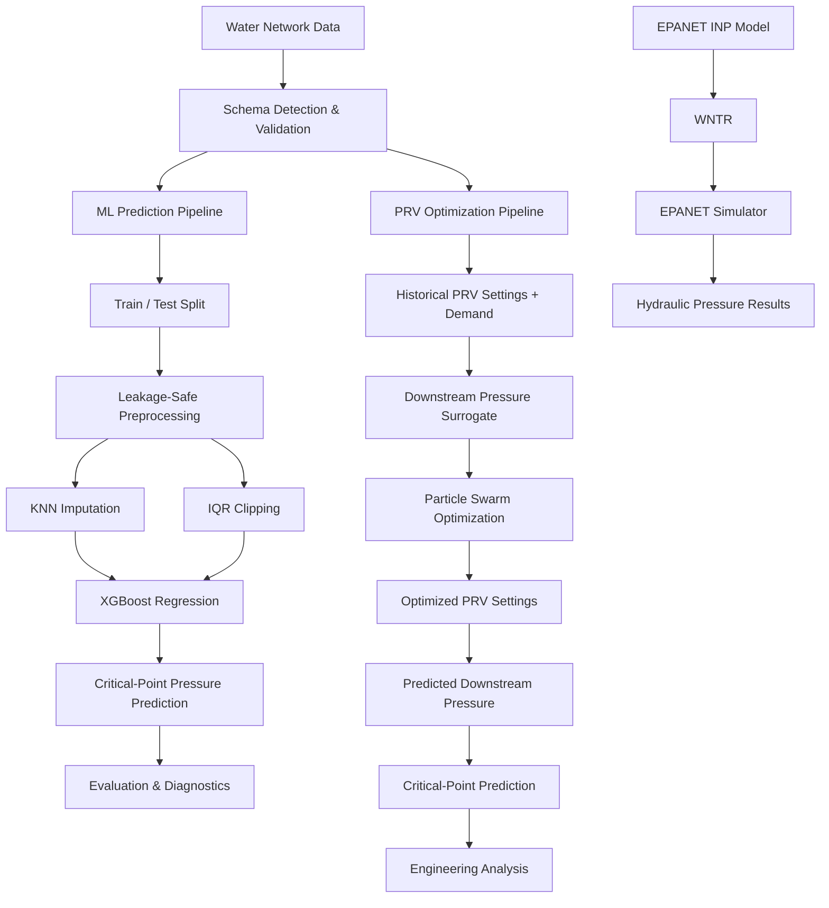
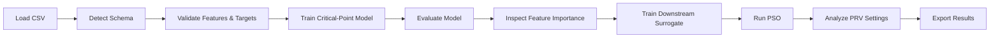
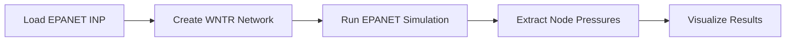
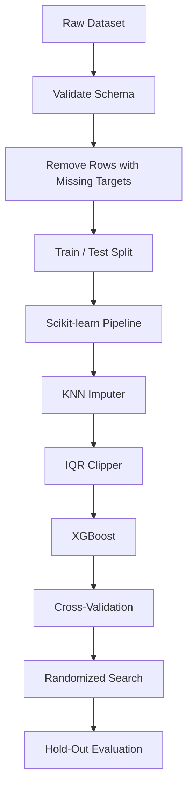
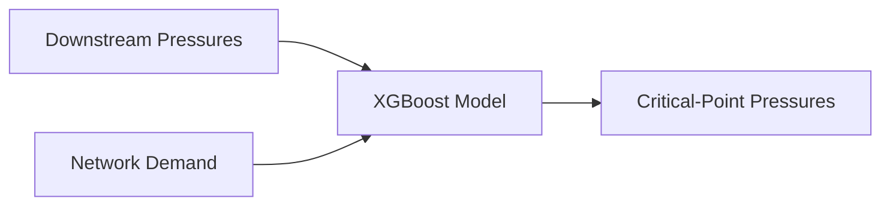
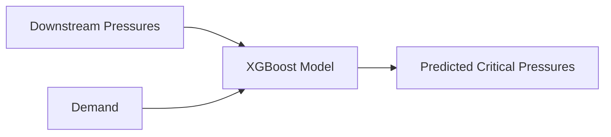
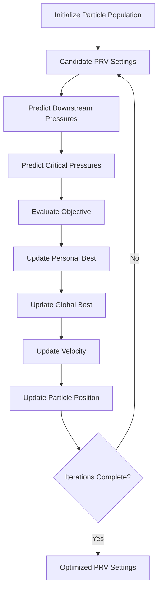
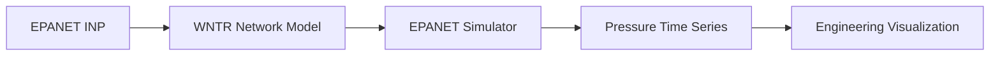

<div align="center">

# Water Network AI Analyzer

### Machine Learning & PRV Optimization for Intelligent Water-Distribution Analysis

**Industrial AI · XGBoost · Particle Swarm Optimization · WNTR / EPANET · Engineering Analytics**

A desktop engineering platform that combines **leakage-safe machine learning, data-driven PRV optimization, and optional physics-based hydraulic simulation** for water-distribution analysis.

[Overview](#overview) · [Architecture](#high-level-architecture) · [Machine Learning](#machine-learning-pipeline) · [Optimization](#prv-optimization) · [Quick Start](#quick-start) · [Limitations](#limitations)

</div>

---

## Overview

**Water Network AI Analyzer** is an applied AI platform for analyzing operational water-network data, predicting critical-point pressures, optimizing Pressure Reducing Valve (PRV) settings, and exploring hydraulic behavior through WNTR / EPANET.

The project brings together three complementary capabilities:

- **Machine Learning** for pressure prediction
- **Optimization** for data-driven PRV control analysis
- **Hydraulic Simulation** for independent physics-based network analysis

A central design principle is the explicit separation between **learned surrogate models** and **hydraulic simulation**.

The machine-learning and PSO workflows learn relationships from historical data.  
The WNTR / EPANET workflow independently executes a physics-based network model when an `.inp` file is available.

---

## Key Capabilities

### Machine Learning

- XGBoost regression
- Single-output and multi-output prediction
- Leakage-safe preprocessing
- Distance-weighted KNN imputation
- Fold-local IQR outlier clipping
- Randomized hyperparameter search
- K-Fold cross-validation
- Hold-out evaluation
- Feature-importance analysis
- Model persistence with Joblib

### PRV Optimization

- Particle Swarm Optimization
- Automatic PRV-column detection
- Data-derived operating bounds
- Sequential multi-period optimization
- Pressure-limit penalties
- Target-pressure objective
- Stability-aware control penalties
- Historical-reference penalties
- PSO convergence tracking

### Hydraulic Analysis

- WNTR integration
- EPANET `.inp` loading
- EPANET simulation through WNTR
- Node-pressure extraction
- Selected-node analysis
- Hydraulic-result visualization

### Desktop Application

- Tkinter graphical interface
- CSV loading and editing
- Automatic schema detection
- Model training and evaluation
- Manual prediction
- Actual-vs-predicted visualization
- Feature-importance visualization
- PSO optimization
- Convergence visualization
- Optimization export
- Model save / load
- Application logging

---

# High-Level Architecture



The platform deliberately maintains two separate analytical paths:

1. **Data-driven AI and optimization**
2. **Physics-based hydraulic simulation**

The current PSO workflow optimizes against learned surrogate models. It does **not** run EPANET inside every optimization iteration.

---

## End-to-End Workflow



Optional physics-based analysis follows a separate workflow:



---

# Machine Learning Pipeline

## Leakage-Safe Preprocessing

Preventing data leakage is a core design decision.



Preprocessing is fitted inside the machine-learning pipeline rather than on the full dataset before splitting.

This prevents the test set from influencing:

- Missing-value imputation
- Outlier thresholds
- Model training
- Cross-validation

---

## Missing-Value Handling

Missing feature values are handled with distance-weighted KNN imputation:

```python
KNNImputer(
    n_neighbors=5,
    weights="distance"
)
```

Target values are not imputed.

Rows with missing targets are excluded because fabricating regression targets would compromise evaluation validity.

---

## Outlier Handling

The project implements a custom scikit-learn-compatible `IQRClipper`.

For each feature:

```text
IQR = Q3 - Q1

Lower Bound = Q1 - 1.5 × IQR
Upper Bound = Q3 + 1.5 × IQR
```

Values outside the learned range are clipped rather than removed.

Because the transformer is part of the scikit-learn pipeline, its limits are learned independently inside training and cross-validation folds.

---

## Predictive Model

The core predictive model is:

**XGBoost Regressor**

For a single target:

```text
Network Features
      │
      ▼
   XGBoost
      │
      ▼
Target Pressure
```

For multiple critical points:

```python
MultiOutputRegressor(
    XGBRegressor(...)
)
```

This allows multiple pressure locations to be estimated simultaneously.

---

## Critical-Point Prediction

The critical-point workflow models the relationship:



This model can later be reused inside the optimization workflow to evaluate candidate PRV configurations.

---

## Hyperparameter Optimization

Model tuning uses:

```text
RandomizedSearchCV
```

The search space includes:

- Number of estimators
- Maximum tree depth
- Learning rate
- Subsample ratio
- Column sampling
- Minimum child weight
- L1 regularization
- L2 regularization

Cross-validation uses shuffled K-Fold splitting with a fixed random seed for reproducibility.

---

## Evaluation

Regression performance is evaluated using:

| Metric | Purpose |
|---|---|
| **MAE** | Average absolute prediction error |
| **RMSE** | Error magnitude with stronger penalty for large errors |
| **R²** | Explained variance / goodness of fit |
| **MAPE** | Relative percentage prediction error |

For multi-output prediction, the application also provides per-target metrics.

Additional diagnostics include:

- Actual vs. predicted plots
- Feature importance
- Per-target performance
- Best hyperparameters
- Cross-validation score
- Training duration
- Hold-out metrics

---

# PRV Optimization

The optimization engine uses **Particle Swarm Optimization (PSO)** to search for improved PRV settings.

> The optimizer is a **data-driven surrogate optimizer**, not a hydraulic solver.

The optimization environment combines two learned relationships.

---

## Downstream Pressure Surrogate


This model learns the historical relationship between valve settings, demand, and downstream pressure.

---

## Critical-Point Surrogate



Together, the two models create the predictive environment evaluated by PSO.

---

## PSO Workflow



---

## Optimization Objective

The objective function combines several engineering considerations.

### Pressure Limits

Predicted pressures outside the default operating interval are heavily penalized:

```text
10 ≤ Pressure ≤ 60
```

### Preferred Pressure

The default preferred operating pressure is:

```text
30
```

### Stability

Large PRV-setting changes between sequential periods are penalized.

This discourages aggressive control changes from one period to the next.

### Historical Reference

The objective can penalize large deviations from historically observed PRV settings.

This helps keep candidate solutions closer to realistic operating regions.

---

## Automatic PRV Detection

PRV variables are detected directly from dataset column names.

The optimizer therefore determines the number of optimization variables from the actual dataset instead of assuming a fixed number of valves.

---

## Data-Driven Bounds

PRV search bounds are estimated from historical operating values and constrained by configured safety limits.

This produces a more realistic optimization domain than assigning the same arbitrary range to every valve.

---

## Sequential Optimization

The default configuration supports sequential optimization across:

```text
24 periods
```

The previous optimized configuration can influence the next period through the stability term.

---

# WNTR / EPANET Integration

The application includes optional physics-based hydraulic analysis using WNTR.

An EPANET network file can be loaded as:

```text
network.inp
```

and simulated through:

```python
wntr.network.WaterNetworkModel(...)
wntr.sim.EpanetSimulator(...)
```

The simulation produces node-pressure time series that can be inspected and visualized.



### Important Distinction

The hydraulic simulation and PSO optimization workflows are currently separate.

The optimizer does not invoke the hydraulic simulator inside each PSO iteration.

This design boundary is stated explicitly to avoid confusing **surrogate optimization** with **physics-based hydraulic optimization**.

---

## Expected Dataset Structure

The application performs automatic semantic column detection.

### PRV Settings

Typical names include:

```text
PRV1
PRV_01
PRV_Setting_1
```

### Downstream / Point-After-Valve Pressure

Recognized naming patterns include:

```text
*-B
*_B
after_valve
after valve
downstream
```

Examples:

```text
PRV-01-B
Valve1_B
Downstream_1
```

### Critical Points

Typical patterns include:

```text
J-*
critical*
critical_point*
```

Examples:

```text
J-101
J-205
Critical_Point_1
```

### Demand

Supported naming conventions include values such as:

```text
Demand
Deby
Flow
Total_Demand
P-676
```

The legacy `P-676` convention is retained for compatibility with the original dataset.

---

## Desktop Application

The GUI provides dedicated workflows for data analysis, modeling, optimization, and hydraulic simulation.

### Data

- Load CSV datasets
- Review detected schema
- Browse records
- Edit values
- Save modified datasets

### Machine Learning

- Train critical-point models
- Review evaluation metrics
- Inspect per-target performance
- Analyze feature importance
- Compare actual and predicted values
- Generate manual predictions
- Save trained models
- Load saved models

### Optimization

- Train downstream pressure surrogates
- Run PSO
- Select optimization horizon
- Inspect optimized PRV settings
- Analyze predicted pressures
- Review convergence behavior
- Export optimization results

### Hydraulic Analysis

- Load EPANET `.inp` files
- Run WNTR / EPANET simulation
- Inspect pressure results
- Visualize selected nodes

---

# Quick Start

## 1. Clone the Repository

```bash
git clone https://github.com/mahmmooudian/water-network-ai-analyzer.git
cd water-network-ai-analyzer
```

## 2. Create a Virtual Environment

### Windows PowerShell

```powershell
python -m venv .venv
.venv\Scripts\Activate.ps1
```

### Windows Command Prompt

```cmd
python -m venv .venv
.venv\Scripts\activate.bat
```

### Linux / macOS

```bash
python3 -m venv .venv
source .venv/bin/activate
```

## 3. Install Core Dependencies

```bash
python -m pip install --upgrade pip
pip install -r requirements.txt
```

The current core dependency file includes the main ML and visualization stack.

## 4. Optional: Install WNTR

Hydraulic simulation requires the optional WNTR package:

```bash
pip install wntr
```

## 5. Run the Application

```bash
python main.py
```

---

## Model Persistence

Trained regression pipelines can be serialized and restored with Joblib.

This allows:

- Model reuse
- Separation of training and prediction
- Faster repeated analysis
- Reproducible downstream workflows

---

## Reproducibility

A fixed random state is used across major stochastic components.

Default:

```text
42
```

This setting is used by components including:

- Train / test splitting
- Cross-validation
- Hyperparameter search
- XGBoost
- PSO initialization

Reproducibility improves consistency between experiments while still depending on the behavior of underlying libraries and execution environments.

---

# Technology Stack

| Area | Technologies |
|---|---|
| **Language** | Python |
| **Machine Learning** | XGBoost, Scikit-learn |
| **Data Processing** | Pandas, NumPy |
| **Optimization** | Particle Swarm Optimization |
| **Hydraulic Simulation** | WNTR, EPANET |
| **Visualization** | Matplotlib |
| **Desktop Interface** | Tkinter |
| **Model Persistence** | Joblib |
| **Configuration** | Python dataclasses |

---

## Project Structure

```text
water-network-ai-analyzer/
│
├── data/
├── docs/
├── gui/
├── hydraulics/
├── models/
├── optimization/
├── results/
├── visualization/
│
├── config.py
├── main.py
├── requirements.txt
├── README.md
├── LICENSE
└── .gitignore
```

The repository separates project responsibilities across dedicated areas for:

- User interface
- Machine learning
- Optimization
- Hydraulic analysis
- Visualization
- Data
- Results
- Documentation

`main.py` remains the primary application entry point, while `config.py` contains centralized application and experiment settings.

---

## Engineering Principles

### Leakage Prevention

Preprocessing is fitted only on training data and within cross-validation folds.

### Reproducibility

Randomized components use a consistent random state.

### Explicit System Boundaries

Surrogate optimization and hydraulic simulation are clearly distinguished.

### Engineering-Aware Optimization

The PSO objective incorporates pressure constraints, operating targets, stability, and historical reference behavior.

### Transparent Evaluation

Multiple regression metrics and visual diagnostics are exposed rather than relying on a single score.

### Realistic Search Bounds

PRV ranges are informed by observed operating data.

### Reusable Models

Trained pipelines can be persisted and loaded without retraining.

---

# Limitations

Water Network AI Analyzer is an **applied AI and engineering research platform**, not an autonomous infrastructure-control system.

Current limitations include:

- Predictive performance depends on the quality and coverage of historical data.
- Surrogate models require engineering validation before operational use.
- Model calibration is dataset-specific.
- PSO optimizes learned surrogate functions rather than hydraulic equations directly.
- WNTR / EPANET simulation currently operates outside the PSO inner loop.
- Real-time SCADA / IoT ingestion is not implemented.
- The repository does not currently provide comprehensive automated test coverage.
- Hydraulic or operational recommendations should be reviewed by qualified domain experts before real-world application.

These limitations are intentionally documented to separate **decision-support research** from **validated operational control**.

---

## Roadmap

Potential future development includes:

- Direct WNTR-in-the-loop optimization
- Expanded automated testing
- Continuous integration
- Time-series demand forecasting
- Leak and anomaly detection
- SCADA / IoT integration
- Model monitoring
- Experiment tracking
- Web-based engineering dashboard
- Containerized deployment
- Benchmark datasets
- Expanded hydraulic validation

---

## Project Status

**Active Development**

The current platform supports:

- Leakage-safe XGBoost modeling
- Critical-pressure prediction
- Multi-output regression
- Surrogate-based PRV optimization
- Engineering visualization
- Model persistence
- Desktop interaction
- Optional WNTR / EPANET simulation

---

## Author

**Amir Mohammad Mahmoudian**

AI Engineer focused on **applied AI, machine learning, optimization, intelligent infrastructure, and ML systems**.

[GitHub](https://github.com/mahmmooudian) · [LinkedIn](https://www.linkedin.com/in/amirmohmmadmahmoudian)

---

## License

This project is released under the **MIT License**.

See [`LICENSE`](LICENSE) for details.

---

<div align="center">

### Machine Learning × Optimization × Hydraulic Engineering

**Building intelligent decision-support systems for real-world infrastructure.**

If this repository is useful to your work or research, consider giving it a ⭐.

</div>
